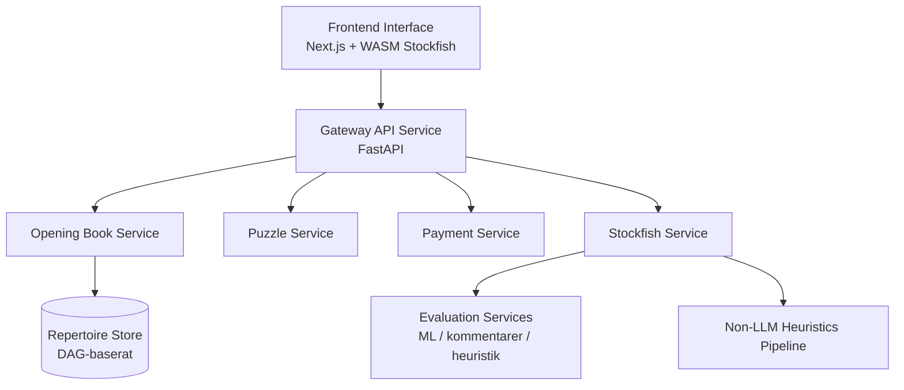
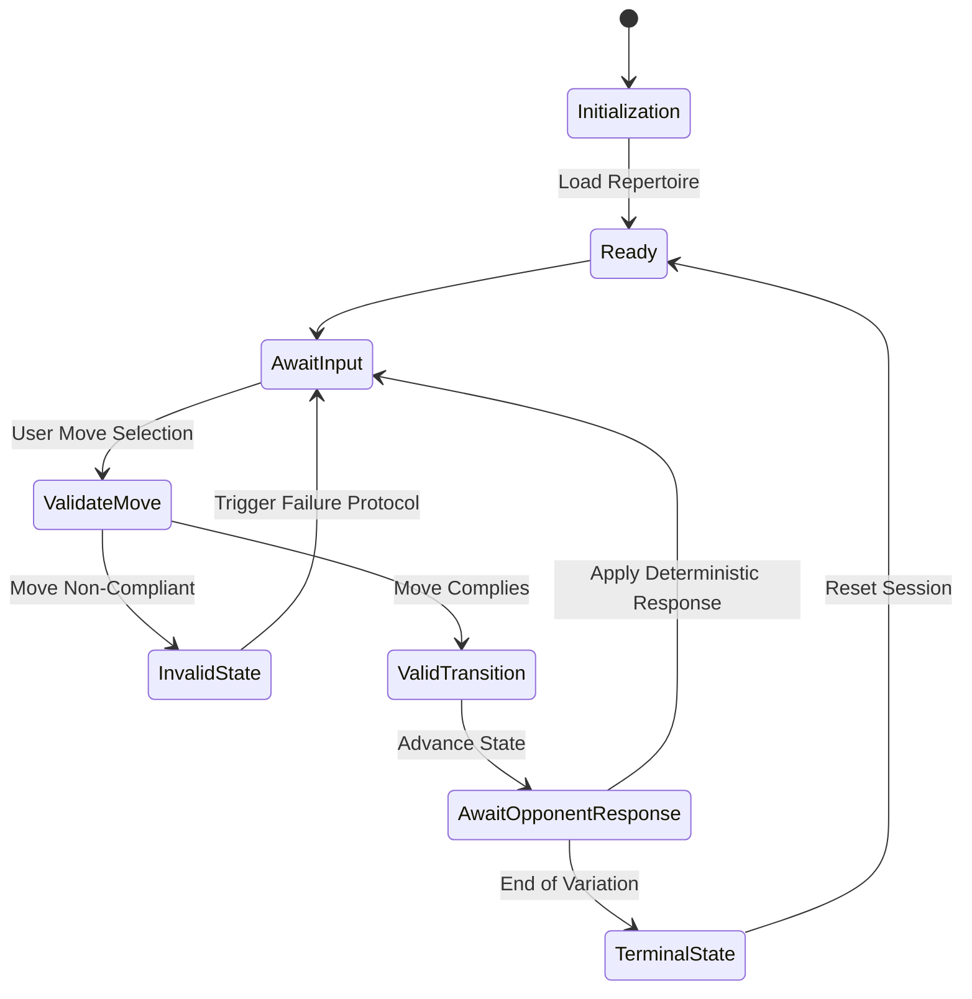

# Deterministic ML Engine

En motor för schackträning och analys som kombinerar deterministisk tillståndsvalidering med ML-baserad utvärdering och kommentarer.

**Notera:** Detta repositorium är en strukturell snapshot för hiring visibility. Proprietär ML-logik, prompt-mallar och feature engineering har ersatts med stubbar.

---

## Systemarkitektur

Systemet separerar deterministisk spellogik från beräkningsintensiv analys:

Klient (Next.js + WASM Stockfish)  
↓  
Gateway (FastAPI)  
↓  
Utvärderingstjänster (ML / kommentarer / heuristik)  
↓  
Repertoarförråd (DAG)



---

## Engineering Highlights

- **Deterministisk kärnmotor** implementerad som en finit tillståndsmaskin (FSM)  
- **DAG-baserad repertoarmodellering** för att hantera transpositioner effektivt  
- **Hybrid utvärderingspipeline** som kombinerar Stockfish, ML-modeller och LLM-baserade kommentarer  
- **Distribuerad mikrotjänstarkitektur** orkestrerad med Kubernetes  
- **Observability (OpenTelemetry, Prometheus)** för latensspårning och tjänstehälsa  

---

## Kärnkomponenter

### Deterministisk träningsmotor
- Finit tillståndsmaskin för strikt dragvalidering  
- Upprätthåller deterministisk traversering av repertoar-träd  



### Repertoarmodellering
- Riktad acyklisk graf (DAG) representation  
- Delade noder för identiska brädställningar (via FEN)  
- Konstant-tid åtkomst till variationer  

### Utvärderingspipeline
- WASM Stockfish (deterministisk utvärdering på klientsidan)  
- ONNX-baserade modeller för mänsklig prediktion  
- LLM-genererade kommentarer grundade i heuristiska signaler  

### Gateway-tjänst
- Hanterar sessionens livscykel och tillståndsövergångar  
- Roultar utvärderingsförfrågningar till backend-tjänster  

---

## Prestanda & Latens

Latens mäts över hela kedjan:
**klient → gateway → utvärdering → svar**

### Problem
- Hög tail latency i Stage-B-pipelinen för kommentarer
- Förfrågningar ärvde stora tidsbudgetar (timeout) från LLM:er
- Arbetare rapporterades som friska ("healthy") innan vLLM var redo

### Lösning
- Begränsade Stage-B-budgetar för förfrågningar
- Begränsad tid för LC0-konceptextraktion
- Tydliga budgetar för förfrågningar och beredskap ("readiness") i arbetare
- Bevarad snabb deterministisk fallback-väg

### Resultat
- Tail latency reducerad från flerminuters-toppar till begränsade svarstider
- Kärninteraktioner (drag-inlämning, traversering av repertoar) förblir under 10 ms (low-ms)

---

## Designval och avvägningar

- **Mikrotjänstarkitektur:** möjliggör oberoende skalning av analysbelastningar men introducerar nätverks-overhead  
- **Inferens på klientsidan:** minskar latens men beror på användarens hårdvarukapacitet  

---

## Arkitektonisk självkritik

- **Resurspress på klienten:** WASM- och ONNX-modeller kan belasta webbläsarens minne  
  → V2: dynamisk delegering av arbetare mellan klient och backend  

- **Stora nyttolaster:** DAG-baserad tillståndsöverföring kan öka initialiseringstiden  
  → V2: progressiv graf-streaming och delta-synk  

- **Risk för UI-responsivitet:** synkron utvärdering kan blockera renderingen  
  → V2: flytta exekvering till Web Workers  

---

## Köra lokalt

```bash
# Frontend
cd ui && npm install && npm run dev

# Backend
cd gateway-service && pip install -r requirements.txt
uvicorn main:app
```

---

## Repositorystruktur

- `/ui`: Next.js frontend with local engine integration
- `/gateway-service`: FastAPI-tjänst som hanterar tillstånd och routing av utvärderingar
- `/services`: Domäntjänster (Stockfish, pussel, utvärdering)
- `/infra`: Kubernetes-manifest och CI/CD-setup
