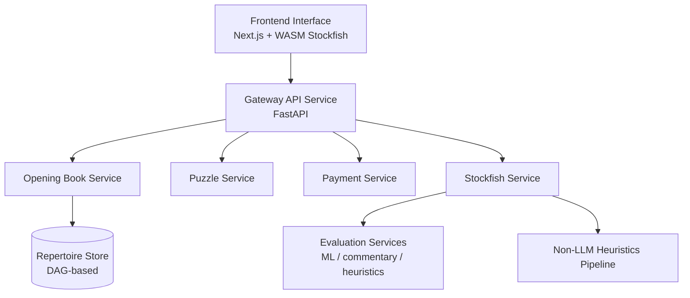
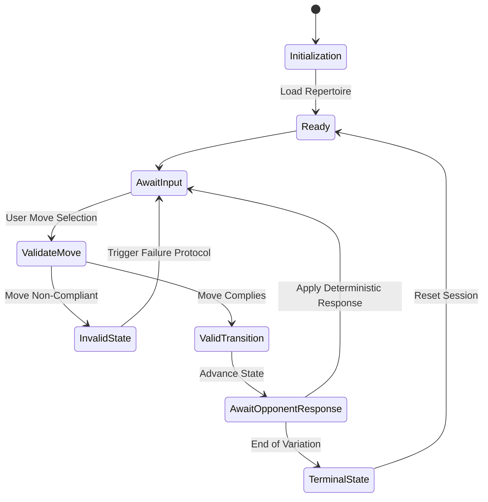

# Deterministic ML Engine

A chess training and analysis engine combining deterministic game state validation with ML-based evaluation and commentary.

**Note:** This repository is a structural snapshot for portfolio visibility. Proprietary ML logic, prompt templates, and feature engineering are replaced with stubs.

---

## System Architecture

The system separates deterministic game logic from compute-heavy evaluation:

Client (Next.js + WASM Stockfish)  
↓  
Gateway (FastAPI)  
↓  
Evaluation Services (ML / commentary / heuristics)  
↓  
Repertoire Store (DAG)



---

## Engineering Highlights

- **Deterministic core engine** implemented as a finite state machine (FSM)  
- **DAG-based repertoire modeling** to handle transpositions efficiently  
- **Hybrid evaluation pipeline** combining Stockfish, ML models, and LLM-based commentary  
- **Distributed microservices architecture** orchestrated with Kubernetes  
- **Observability (OpenTelemetry, Prometheus)** for latency tracking and service health  

---

## Core Components

### Deterministic Training Engine
- Finite state machine for strict move validation  
- Enforces deterministic traversal of repertoire trees  



### Repertoire Modeling
- Directed acyclic graph (DAG) representation  
- Shared nodes for identical board states (via FEN)  
- Constant-time access to variations  

### Evaluation Pipeline
- WASM Stockfish (client-side deterministic evaluation)  
- ONNX-based human prediction models  
- LLM-generated commentary grounded in heuristic signals  

### Gateway Service
- Manages session lifecycle and state transitions  
- Routes evaluation requests to backend services  

---

## Performance & Latency

Latency is measured across:
**client → gateway → evaluation → response**

### Issue
- High tail latency in Stage-B commentary pipeline
- Requests inherited large LLM timeout budgets
- Workers reported healthy before vLLM was ready

### Fix
- Bounded Stage-B request budgets
- Limited LC0 concept extraction time
- Explicit request + readiness budgets in workers
- Preserved fast deterministic fallback path

### Result
- Tail latency reduced from multi-minute spikes to bounded response times
- Core interactions (move submission, repertoire traversal) remain low-ms

---

## Design Trade-offs

- **Microservices architecture:** enables independent scaling of evaluation workloads but introduces network overhead  
- **Client-side inference:** reduces latency but depends on user hardware capabilities  

---

## Architectural Self-Critique

- **Client resource pressure:** WASM and ONNX models can strain browser memory  
  → V2: dynamic worker delegation between client and backend  

- **Large payloads:** DAG-based state transfer can increase initialization time  
  → V2: progressive graph streaming and delta-sync  

- **UI responsiveness risk:** synchronous evaluation may block rendering  
  → V2: move execution to Web Workers  

---

## Running Locally

```bash
# Frontend
cd ui && npm install && npm run dev

# Backend
cd gateway-service && pip install -r requirements.txt
uvicorn main:app
```

---

## Repository Structure

- `/ui`: Next.js frontend with local engine integration
- `/gateway-service`: FastAPI service managing state and evaluation routing
- `/services`: Domain services (Stockfish, puzzles, evaluation)
- `/infra`: Kubernetes manifests and CI/CD setup
