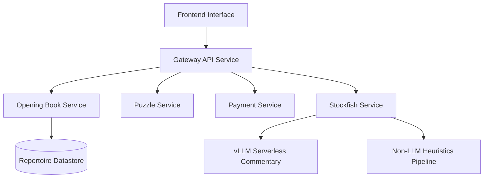
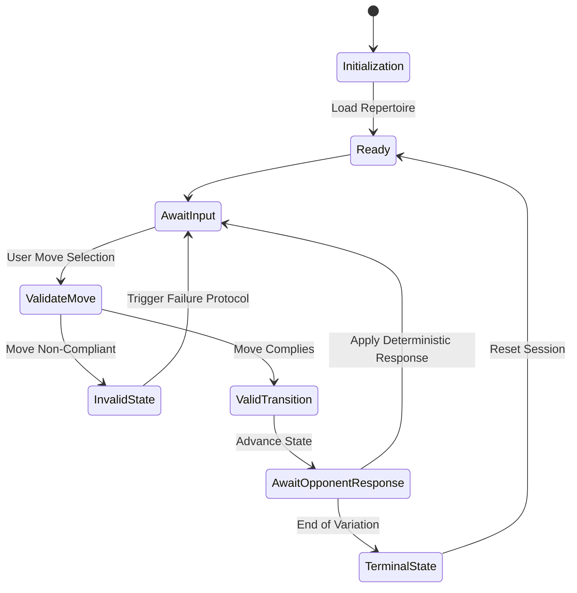

# Deterministic ML Engine (Structural Snapshot)

This repository serves as a structural blueprint of a production-grade engine-grounded commentary system. It combines deterministic tree search outputs (e.g., Stockfish) with probabilistic representations and LLM-synthesized commentary.

> **Note:** For hiring visibility purposes, proprietary ML probing logic (LC0 integration, SVM extraction), exact prompt templates, and feature engineering details have been replaced with generic stubs. No production secrets or domains are included.

## System Architecture

The project splits the board evaluation pipeline into a multi-tier architecture:
- **Client Application (`ui`)**: Next.js service with Web Worker-based local engine integration.
- **Gateway Service (`gateway-service`)**: Python/FastAPI middleware that manages the Commentary State DAG and proxies evaluation requests.
- **Heuristic Engine**: Extracted board metrics and tactical concept identification. *(Proprietary heuristics stubbed).*

## Getting Started

*(Structural Snapshot: Provided for Review Only)*

- `cd ui && npm install && npm run dev`
- `cd gateway-service && uvicorn main:app`

See [ARCHITECTURE.md](ARCHITECTURE.md), [SYSTEM_DESIGN.md](SYSTEM_DESIGN.md), and [SECURITY.md](SECURITY.md) for more structural details.

---

## Original Project Documentation

> **Note:** The following is the original README from the production repository (with identifying names sanitized). It provides detailed context on the architecture and implementations that have been stubbed out in this snapshot.

*Read this in other languages: [English](README.md), [Svenska](README-sv.md)*

# Deterministic ML Engine

## Problem Statement
Structured chess repertoire training is fundamentally a deterministic systems problem, governed by strict state validation and acyclic graph traversals. Naive move recall systems fail by treating variations as isolated iterations rather than interconnected state transitions within a broader game tree. Deterministic ML Engine provides a deterministic engine for repertoire execution, where evaluation logic and probabilistic modeling act strictly as modular backend abstractions rather than core state drivers. The platform focuses exclusively on rigorous candidate move validation against pre-defined repertoire definitions, explicitly avoiding generic game playing or abstract pattern recognition.

## Platform Architecture
The system enforces strict decoupling between the user interface, the deterministic validation engine, and the evaluation layers through a distributed Kubernetes microservices architecture. The frontend interacts with a central Gateway API service, which routes requests to specialized domain services (e.g., Opening Book, Puzzle, Payment, Stockfish). This allows computational workloads—particularly stateless evaluation and inference tasks—to be orchestrated and scaled independently across cluster nodes while maintaining a synchronized, deterministic state.

## Training Engine Design
The training core operates as a finite state machine, handling state transitions as discrete moves applied to an internal board representation. Validation is deterministic: candidate moves originating from the frontend are evaluated strictly against the loaded repertoire tree. The session lifecycle exclusively manages initialization, state traversal, and terminal boundary detection.

## Repertoire Modeling
Repertoires are modeled as directed acyclic graphs (DAGs) representing sequential opening lines and associated variations. This structure handles transpositions natively by mapping identical board states (via FEN) to shared graph nodes, preventing combinatorial explosion across overlapping lines. Graph modeling was prioritized over relational mapping due to the necessity of constant-time sibling-node lookups during rapid state transitions.

## Evaluation Backends
Machine learning and traditional engine evaluations augment the analysis phase but remain peripheral to the deterministic core. These layers are implemented behind a unified evaluation interface and are strictly optional for platform execution:
- **WASM Stockfish:** Provides a deterministic reference evaluation running entirely client-side.
- **ONNX Maia:** A human-prediction ML model utilizing client-side inference to minimize latency and server overhead.
- **LC0 Experimentation:** Modular backend for neural network traversal analysis.
- **SVM Probes & vLLM Serverless Commentary:** A modular pipeline providing natural-language analysis. The vLLM serverless instance does not evaluate raw board states; instead, it consumes structured feature vectors extracted from localized SVM evaluation probes. Probabilistic models are constrained through engine-grounded retrieval (Stockfish, heuristic probes, LC0 signals) before synthesis, ensuring that generative components never influence state transitions.
- **Non-LLM Heuristic Commentary:** A fallback analysis generating static text directly from SVM heuristic probes when the vLLM instance is cold or execution latency constraints dictate a serverless scale-to-zero state.

## Systems & Operations
Deterministic ML Engine is deployed via a CI/CD pipeline enforcing automated testing of the microservices across rigid boundary conditions. The deployment model utilizes Kubernetes (K8s) for container orchestration, dynamically scaling evaluation pods (such as the Stockfish Service and inference engines) based on incoming load. Telemetry is aggregated across the cluster to monitor inter-service latency, pod health, and resource constraints, ensuring heavy compute modules do not bottleneck the gateway API.

## Design Trade-offs
- **Microservices vs Monolith:** Adopting a distributed Kubernetes architecture introduces network overhead and state synchronization complexity. However, this is heavily outweighed by the ability to horizontally scale computationally expensive evaluation services (like Stockfish or ONNX inference pods) entirely independently of lightweight, deterministic state-tracking services like the opening book endpoints.
- **Deterministic Core vs ML Augmentation:** Strict adherence to deterministic validation guarantees predictable training behavior, isolating experimental ML features to distinct, independently deployable evaluation services where execution variance is acceptable.
- **Client-Side vs Server-Side Compute:** While some inference is parameterized for the client hardware to reduce latency, the Kubernetes backend robustly handles complex, distributed server-side asynchronous evaluations when client limits are exceeded.

## Scalability Considerations
The primary bottleneck lies in client-side memory management during extensive tree traversals and ONNX resource allocation. The backend scales predictably, handling primarily lightweight JSON payloads containing serialized graph subsets. Evaluation modules scale linearly with the end-user's hardware capabilities rather than backend cluster capacity. Future architectural iterations may require edge-caching for large repertoire payload distributions.

## Future Roadmap
- Integration of state-aware opponent modeling via deterministic bot interfaces.
- Advanced telemetry querying for localized training progress analytics.
- Introduction of distributed evaluation workers for asynchronous deep analysis offloading.
- Incremental algorithmic refinement of the SVM evaluation research module.

***

## Architectural Self-Critique

**Architectural Weaknesses:**
1. **Frontend Resource Saturation:** Delegating substantial operations (WASM Stockfish execution, ONNX parameter loading, and extensive DAG traversal) specifically to the client demands significant volatile memory allocation. This creates a hard degradation in UX reliability on constrained edge devices or mobile hardware.
2. **Monolithic Payload Bottlenecks:** Delivering entire graph nodes directly via JSON payloads exposes the system to severe network vulnerabilities for larger, master-level repertoires. The lack of a partial computation or delta-sync architecture risks excessive load times during domain initialization.
3. **Synchronous Execution Coupling:** Running the deterministic state validation synchronously with the frontend rendering cycle risks dropping animation frames during complex combinatorial evaluations, penalizing the perceived platform responsiveness when transpositions bridge deeply nested DAG layers.

**Realistic V2 Improvements:**
1. **Web-Worker Delegation Layer:** Decouple the deterministic execution domain and evaluation engines from the primary Javascript thread via dedicated Web Workers. This ensures rendering responsiveness and input buffering remains deterministic regardless of the computational weight of validation state logic.
2. **Progressive Graph Streaming API:** Re-architect the backend API to issue paginated, traversal-driven subgraphs rather than complete repertoire dumps. Implementing a differential update protocol (delta-sync) will flatten the initialization curve.
3. **Hybrid Fallback Evaluation Architecture:** Build a dynamic latency monitor that allows client evaluation modules to gracefully failover to stateless, lambda-backed server endpoints if local computing constraints are exceeded, ensuring functional continuity rather than unhandled client-side runtime panic.

---

## Original Project Documentation

> **Note:** The following is the original README from the production repository (with identifying names sanitized). It provides detailed context on the architecture and implementations that have been stubbed out in this snapshot.

*Read this in other languages: [English](README.md), [Svenska](README-sv.md)*

# Deterministic ML Engine

## Problem Statement
Structured chess repertoire training is fundamentally a deterministic systems problem, governed by strict state validation and acyclic graph traversals. Naive move recall systems fail by treating variations as isolated iterations rather than interconnected state transitions within a broader game tree. Deterministic ML Engine provides a deterministic engine for repertoire execution, where evaluation logic and probabilistic modeling act strictly as modular backend abstractions rather than core state drivers. The platform focuses exclusively on rigorous candidate move validation against pre-defined repertoire definitions, explicitly avoiding generic game playing or abstract pattern recognition.

## Platform Architecture
The system enforces strict decoupling between the user interface, the deterministic validation engine, and the evaluation layers through a distributed Kubernetes microservices architecture. The frontend interacts with a central Gateway API service, which routes requests to specialized domain services (e.g., Opening Book, Puzzle, Payment, Stockfish). This allows computational workloads—particularly stateless evaluation and inference tasks—to be orchestrated and scaled independently across cluster nodes while maintaining a synchronized, deterministic state.

## Training Engine Design
The training core operates as a finite state machine, handling state transitions as discrete moves applied to an internal board representation. Validation is deterministic: candidate moves originating from the frontend are evaluated strictly against the loaded repertoire tree. The session lifecycle exclusively manages initialization, state traversal, and terminal boundary detection.

## Repertoire Modeling
Repertoires are modeled as directed acyclic graphs (DAGs) representing sequential opening lines and associated variations. This structure handles transpositions natively by mapping identical board states (via FEN) to shared graph nodes, preventing combinatorial explosion across overlapping lines. Graph modeling was prioritized over relational mapping due to the necessity of constant-time sibling-node lookups during rapid state transitions.

## Evaluation Backends
Machine learning and traditional engine evaluations augment the analysis phase but remain peripheral to the deterministic core. These layers are implemented behind a unified evaluation interface and are strictly optional for platform execution:
- **WASM Stockfish:** Provides a deterministic reference evaluation running entirely client-side.
- **ONNX Maia:** A human-prediction ML model utilizing client-side inference to minimize latency and server overhead.
- **LC0 Experimentation:** Modular backend for neural network traversal analysis.
- **SVM Probes & vLLM Serverless Commentary:** A modular pipeline providing natural-language analysis. The vLLM serverless instance does not evaluate raw board states; instead, it consumes structured feature vectors extracted from localized SVM evaluation probes. Probabilistic models are constrained through engine-grounded retrieval (Stockfish, heuristic probes, LC0 signals) before synthesis, ensuring that generative components never influence state transitions.
- **Non-LLM Heuristic Commentary:** A fallback analysis generating static text directly from SVM heuristic probes when the vLLM instance is cold or execution latency constraints dictate a serverless scale-to-zero state.

## Systems & Operations
Deterministic ML Engine is deployed via a CI/CD pipeline enforcing automated testing of the microservices across rigid boundary conditions. The deployment model utilizes Kubernetes (K8s) for container orchestration, dynamically scaling evaluation pods (such as the Stockfish Service and inference engines) based on incoming load. Telemetry is aggregated across the cluster to monitor inter-service latency, pod health, and resource constraints, ensuring heavy compute modules do not bottleneck the gateway API.

## Design Trade-offs
- **Microservices vs Monolith:** Adopting a distributed Kubernetes architecture introduces network overhead and state synchronization complexity. However, this is heavily outweighed by the ability to horizontally scale computationally expensive evaluation services (like Stockfish or ONNX inference pods) entirely independently of lightweight, deterministic state-tracking services like the opening book endpoints.
- **Deterministic Core vs ML Augmentation:** Strict adherence to deterministic validation guarantees predictable training behavior, isolating experimental ML features to distinct, independently deployable evaluation services where execution variance is acceptable.
- **Client-Side vs Server-Side Compute:** While some inference is parameterized for the client hardware to reduce latency, the Kubernetes backend robustly handles complex, distributed server-side asynchronous evaluations when client limits are exceeded.

## Scalability Considerations
The primary bottleneck lies in client-side memory management during extensive tree traversals and ONNX resource allocation. The backend scales predictably, handling primarily lightweight JSON payloads containing serialized graph subsets. Evaluation modules scale linearly with the end-user's hardware capabilities rather than backend cluster capacity. Future architectural iterations may require edge-caching for large repertoire payload distributions.

## Future Roadmap
- Integration of state-aware opponent modeling via deterministic bot interfaces.
- Advanced telemetry querying for localized training progress analytics.
- Introduction of distributed evaluation workers for asynchronous deep analysis offloading.
- Incremental algorithmic refinement of the SVM evaluation research module.

***

## Architectural Self-Critique

**Architectural Weaknesses:**
1. **Frontend Resource Saturation:** Delegating substantial operations (WASM Stockfish execution, ONNX parameter loading, and extensive DAG traversal) specifically to the client demands significant volatile memory allocation. This creates a hard degradation in UX reliability on constrained edge devices or mobile hardware.
2. **Monolithic Payload Bottlenecks:** Delivering entire graph nodes directly via JSON payloads exposes the system to severe network vulnerabilities for larger, master-level repertoires. The lack of a partial computation or delta-sync architecture risks excessive load times during domain initialization.
3. **Synchronous Execution Coupling:** Running the deterministic state validation synchronously with the frontend rendering cycle risks dropping animation frames during complex combinatorial evaluations, penalizing the perceived platform responsiveness when transpositions bridge deeply nested DAG layers.

**Realistic V2 Improvements:**
1. **Web-Worker Delegation Layer:** Decouple the deterministic execution domain and evaluation engines from the primary Javascript thread via dedicated Web Workers. This ensures rendering responsiveness and input buffering remains deterministic regardless of the computational weight of validation state logic.
2. **Progressive Graph Streaming API:** Re-architect the backend API to issue paginated, traversal-driven subgraphs rather than complete repertoire dumps. Implementing a differential update protocol (delta-sync) will flatten the initialization curve.
3. **Hybrid Fallback Evaluation Architecture:** Build a dynamic latency monitor that allows client evaluation modules to gracefully failover to stateless, lambda-backed server endpoints if local computing constraints are exceeded, ensuring functional continuity rather than unhandled client-side runtime panic.

